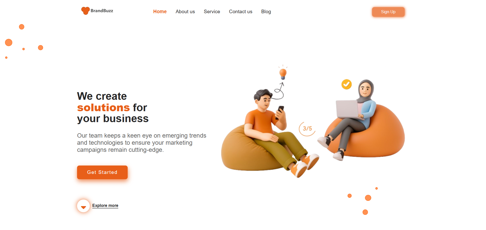

# 💼 Projeto Landing Page Institucional

Este repositório contém o escopo de desenvolvimento de uma **landing page institucional**, simulando um projeto real do mercado de trabalho. O layout é focado em apresentação de serviços e captação de usuários via CTA (Call To Action).

## 🖼️ Protótipo de Referência

> ⚠️Prototipo para clonar.



---

## 📌 Estrutura Esperada

- **Cabeçalho (Header):**
  - Logotipo à esquerda
  - Menu com 5 itens
  - Botão "Sign Up" à direita

- **Sessão Hero (Banner Principal):**
  - Título com destaque na palavra **solutions**
  - Parágrafo explicativo
  - Botão “Get Started”
  - Link “Explore More” com ícone
  - Imagem ilustrativa à direita

---

## 🎨 Paleta de Cores

| Variável            | Cor       | Uso Principal            |
|---------------------|-----------|--------------------------|
| `--primary-color`   | `#e85f19` | Destaques, botões        |
| `--secondary-color` | `#ee8a56` | Sombras, hover           |
| `--dark-color`      | `#262627` | Títulos, texto principal |
| `--info-color`      | `#5d5d5d` | Parágrafos               |
| `--light-color`     | `#f8f9fc` | Fundo, textos claros     |

---

## 🧱 Estrutura do Projeto

```

/projeto-landing-page/
├── index.html
├── /css/
│   └── style.css
├── /assets/
│   └── /images/
│       ├── logo.png
│       ├── banner.png
│       └── bg.png

```

---

## ✅ Requisitos Gerais

- HTML semântico e organizado
- CSS modular com uso de variáveis
- Responsividade básica (desktop)
- Design fiel ao protótipo apresentado
- Utilização do Font Awesome para ícones

---
📥 Link para o Font Awesome 7.1

Para utilizar os ícones do Font Awesome em seu projeto, adicione o seguinte código no <head> do seu arquivo index.html:

<!-- Font Awesome 7.1 -->
<link rel="stylesheet" href="https://cdnjs.cloudflare.com/ajax/libs/font-awesome/7.1.0/css/all.min.css">


Você pode encontrar mais ícones e opções no site oficial do Font Awesome: Font Awesome Icons
---
## 📌 Entrega Esperada

- Estrutura completa em HTML/CSS
- Organização profissional de pastas
- (Opcional) Deploy via GitHub Pages

---

## 📎 Observações Finais

Este projeto simula um pedido real de cliente, sem tutoriais. A execução deve refletir autonomia, atenção aos detalhes e boas práticas de desenvolvimento front-end.


